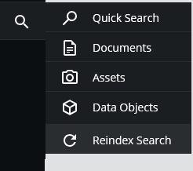

# Pimcore Search Backend Reindex Bundle

A Pimcore bundle that enables authorized users to trigger search reindexing directly from the Pimcore UI.

## The Problem

Pimcore provides a console command to re-index the backend search (provided that the Backend Search Bundle is installed):

```bash
bin/console pimcore:search-backend-reindex
```

The command reindexes the Pimcore backend search, ensuring that newly created elements can be found correctly.

The problem is that this command needs to be executed from the server environment. A user therefore needs access to the server and the ability to execute Pimcore console commands.

For administrators or other users who work exclusively with Pimcore, there is no corresponding action in the Pimcore UI that allows them to trigger the reindex.

This can become inconvenient in projects where a reindex is required on a regular basis.

## A Real-World Use Case

At my previous agency, I worked on a Pimcore project for a customer who regularly needed to reindex the Pimcore Backend Search.

Whenever a reindex was required, someone with server access had to manually execute the console command on behalf of the customer.

One possible workaround would be to run the reindex command periodically using a cron job. However, this is not necessarily an ideal solution either. A cron job performs the reindex at a fixed interval, regardless of whether a reindex is actually required at that particular time. Depending on the project and the amount of data, regularly rebuilding the entire search index can also unnecessarily consume server resources.

For this use case, it is more practical to allow authorized users to trigger a reindex whenever it is actually needed, without requiring them to have access to the server.

## The Solution

This bundle adds a re-index action to the Pimcore UI that allows authorized users to trigger the backend search re-indexing without requiring server access.

Access to the functionality is controlled through a dedicated Pimcore permission. This makes it possible to grant the ability to perform a reindex only to specific users or user roles.

The goal is not to replace the existing `pimcore:search-backend-reindex` console command, but to make the same functionality available to appropriately authorized Pimcore users directly through the Pimcore UI.

## Features

- Trigger the Pimcore backend search re-indexing directly from the Pimcore UI.
- No server access required for authorized users
- Dedicated Pimcore permission to control access
- Uses Symfony Messenger for asynchronous processing
- Provides a notification when the reindex process has been completed

## Requirements

- **Pimcore Simple Backend Search Bundle** must be installed (It is not a separate bundle; it is included in the default Pimcore installation but needs to be enabled first)

## Installation

### 1. Add the repository

The bundle is currently installed through a VCS repository.

Add the following repository to the `composer.json` of your Pimcore project:

```json
"repositories": [
    {
        "type": "vcs",
        "url": "git@github.com:Girgl1995/pimcore-search-backend-reindex-bundle.git"
    }
]
```

### 2. Install the bundle

Install the bundle using Composer:

```bash
composer require factotum/search-backend-reindex-bundle:dev-master
```

### 3. Register the bundle

After installing the bundle, register it in `config/bundles.php`:

```php
// ...
use Factotum\SearchBackendReindexBundle\PimcoreSearchBackendReindexBundle;

return [
    // ...
    PimcoreSearchBackendReindexBundle::class => ['all' => true]
];
```

### 4. Run the database migration

The bundle adds a dedicated Pimcore permission and a database table for tracking the currently active reindexing request.

Run the migration with:

```bash
bin/console doctrine:migrations:execute --up Factotum\SearchBackendReindexBundle\Migrations\Version20261003200558
```

### 5. Install the assets

After registering the bundle, install its assets:

```bash
bin/console assets:install
```

### 6. Clear the cache

After completing the installation, clear the Symfony and Pimcore caches:

```bash
bin/console cache:clear
bin/console pimcore:cache:clear
```

## Messenger Worker

This feature uses the Symfony Messenger component. Messages sent through the `search_backend_reindex` transport need to be consumed after installing the bundle.

The following Messenger worker must be running:

```bash
bin/console messenger:consume search_backend_reindex
```

The worker needs to be run via a **process manager**, such as **Supervisord**, to ensure that messages sent to the `search_backend_reindex` transport are continuously consumed.

For development or testing purposes, the worker can also be started manually from the console.

## Usage

After the bundle has been installed and the Messenger worker is running, users with the required permission can trigger a backend search reindex directly from the Pimcore UI.

The **Backend Search** menu is extended with a corresponding reindex action.

<p align="center">
  
</p>

### Permissions

The bundle provides a dedicated Pimcore permission for triggering a backend search re-index.

The permission can be assigned to specific users or user roles. This allows you to control exactly who is allowed to perform a reindex.

Users without the required permission will not have access to the reindex functionality.

<p align="center">
  
</p>

### Reindex Notification

The reindex operation is processed asynchronously through Symfony Messenger.

Once the reindexing process has been completed, the user receives a corresponding notification in the Pimcore backend.

<p align="center">
  
</p>

### Configuration

The bundle allows you to configure the memory limit used during the backend search re-index command.

For example, you **can** add the following configuration to your Symfony configuration:

```yaml
factotum_search_backend_reindex:
    memory_limit: '1G'
```

The **memory_limit** defines the PHP memory limit used during the reindex process.

If **memory_limit** is not configured or contains an invalid value, the bundle falls back to the global PHP memory limit.